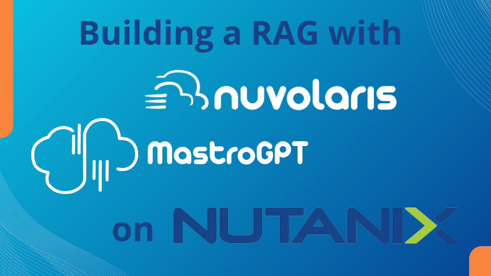
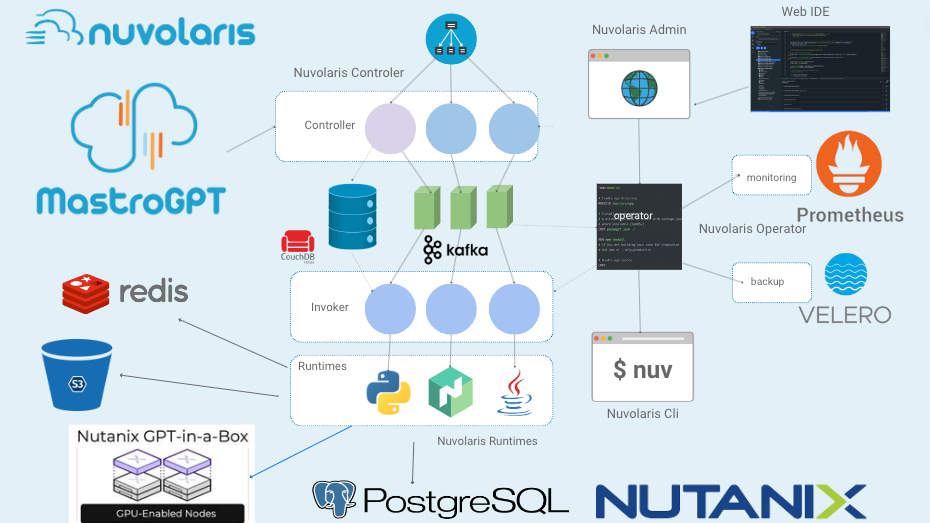

---

# Agenda

1. ### Introducing Nuvolaris & OpenServerless
2. ### Running Nuvolaris on Nutanix
3. ### Building a RAG using Nutanix Services
4. ### Importing Content in the Nutanix Database 

---

---

--- 
## Nuvolaris Components

- ### A scalable serverless engine
- ### Support for front-end
- ### S3 File Storage
- ### Database Data Storage
- ### Redis Cache
- ### Backup & Monitoring

--- 
####  Welcome to Nuvolaris

<video src="https://s3.amazonaws.com/v3d.it/nuvolaris/demo-nuvolaris-mastrogpt.mp4#t=10,20" controls>
</video>

---

--- 
## Tight Nutanix Integration

  - #### Deployed with Calm scripts
  - #### Running in Nutanix Kubernetes
  - #### Storing Data in Nutanix Databases
  - #### Using LLM with the GPT-in-a-box 

---

---

